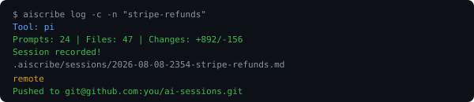

<p align="center">
  
</p>

<p align="center">
  <strong>Your AI's scribe. Every session, recorded.</strong>
</p>

<p align="center">
  <a href="https://www.npmjs.com/package/aiscribe"></a>
  <a href="https://www.npmjs.com/package/aiscribe"></a>
  <a href="https://github.com/aiagentflow/aiscribe/blob/main/LICENSE"></a>
  <a href="https://github.com/aiagentflow/aiscribe"></a>
</p>

<p align="center">
  
</p>

---

**AIScribe** is a CLI tool that journals every AI coding session into a structured, searchable log. One command after every session and you never lose context again.

Works with Claude Code, Cursor, Codex, Aider, Windsurf, or any AI coding tool — it reads your git diff.

Part of the [aiagentflow](https://aiagentflow.dev) suite.

## Quick Start

```bash
npm install -g aiscribe@1.0.0

# First run: pick your LLM provider and paste API key
cd /your/project
aiscribe log

# With conversation capture (pi, Claude Code, Codex, Aider)
aiscribe log -c -n "my-feature"
```

On first run, AIScribe asks you to select an LLM provider and enter your API key. Config is saved to `~/.aiscribe/config.json` and never asked again.

## What You Get

```
.aiscribe/sessions/2026-08-08-stripe-refunds.md
```

```markdown
# Session: stripe-refunds

**Date:** 2026-08-08 14:32
**Files changed:** 47
**Lines:** +892 / -156

## Summary
Implemented Stripe refund processing with webhook support...

## Chunks
- Payment API (6 files, Medium risk)
- Database migration (2 files, Low risk)

## Key Decisions
- Used Stripe webhooks instead of polling

## Suspicious Changes
- auth.ts changed but unrelated to refunds
```

## Commands

| Command | What It Does |
|---------|-------------|
| `aiscribe log` | Journal current git diff as a session |
| `aiscribe log -c` | Include AI tool conversation context |
| `aiscribe log -n "name"` | Custom session name |
| `aiscribe search "query"` | Semantic or keyword search |
| `aiscribe hotspots` | Files that change most often |
| `aiscribe history <file>` | Timeline for a file |
| `aiscribe context` | Export history for AI agents |
| `aiscribe status` | Active AI coding sessions |
| `aiscribe watch` | Auto-detect session completion |
| `aiscribe export --format json` | Export sessions |
| `aiscribe sync` | Push to server/DB |
| `aiscribe server` | Start web UI on `localhost:3848` |
| `aiscribe doctor` | Validate your setup |
| `aiscribe setup` | Docker files or reconfigure provider |

## Providers

AIScribe auto-detects your key type. You can also set it explicitly:

```bash
export AISCRIBE_API_KEY=sk-or-...    # OpenRouter (200+ models, recommended)
export AISCRIBE_API_KEY=sk-ant-...   # Anthropic Claude
export AISCRIBE_API_KEY=sk-...       # OpenAI, DeepSeek, or custom
export AISCRIBE_PROVIDER=deepseek
export AISCRIBE_PROVIDER=ollama      # Free & local
```

| Provider | Models | Cost |
|----------|--------|------|
| OpenRouter | Claude, GPT, DeepSeek, Qwen, Gemini + 200 more | Pay per use |
| DeepSeek | deepseek-chat | $0.14/M tokens |
| Anthropic | Claude Sonnet, Opus | Higher quality |
| OpenAI | GPT-4o, GPT-4o-mini | Pay per use |
| Ollama | Llama, Qwen, Mistral (local) | Free |

## AI Tool Support

| Tool | Conversation | Git Diff |
|------|-------------|----------|
| **pi** | Full (prompts + responses + tool calls) | Yes |
| **Claude Code** | Prompts only* | Yes |
| **Codex** | Prompts only* | Yes |
| **Aider** | Prompts only* | Yes |

*These tools don't persist assistant responses to disk. See [docs/SUPPORTED-TOOLS.md](docs/SUPPORTED-TOOLS.md) for details.

## Web UI

```bash
aiscribe server
# Open http://localhost:3848
```

Dark-themed session book with search, pagination, and full session detail view. Works with or without Docker.

## Docker (optional)

```bash
aiscribe setup
cd .aiscribe && docker-compose up -d
```

Spins up PostgreSQL + pgvector for future semantic search features.

## How It Works

1. You finish an AI coding session (any tool)
2. Run `aiscribe log` — it reads your git diff
3. Optionally captures prompt history from Claude Code/Codex/Aider
4. Sends to your chosen LLM for summarization
5. Saves a structured markdown file to `.aiscribe/sessions/`
6. Updates `.aiscribe/index.json` for quick lookups

## Why

After 2 weeks of AI coding sessions, you have no memory of what changed or why. AIScribe fixes that by creating a permanent, searchable journal of every session.

- **Never lose context**: search "payment" to find all sessions that touched payment code
- **Understand decisions**: every session captures the "why" not just the "what"
- **Catch surprises**: AIScribe flags suspicious changes (files changed outside the main domain)
- **Team visibility**: commit `.aiscribe/` to your repo and your team sees every AI decision

## Roadmap

- [x] Git diff summarization
- [x] AI tool context capture (Claude Code, Codex, Aider)
- [x] Interactive onboarding
- [x] Web UI (session book)
- [x] Multi-provider LLM support
- [x] Docker + PostgreSQL setup
- [ ] Terminal UX with colors
- [ ] Vector embeddings + semantic search
- [ ] Pattern matching across sessions
- [ ] Team sharing

## License

MIT — part of the [aiagentflow](https://github.com/aiagentflow) project.
